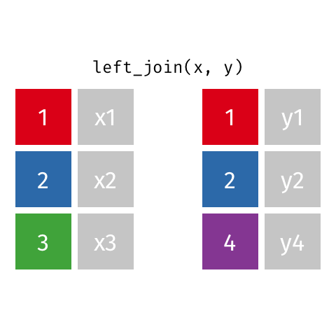

```{r child = "setup.Rmd"}
```

```{r packages, echo=FALSE, message=FALSE, warning=FALSE}
library(tidyverse)
library(openintro)
library(kableExtra)
library(knitr)
loans_full_schema <- loans_full_schema %>%
  mutate(grade = factor(grade, ordered = TRUE))
```

```{r xaringan-tile-view, echo=FALSE}
xaringanExtra::use_tile_view()
```

```{r xaringan-editable, echo=FALSE}
xaringanExtra::use_editable(expires = 1)
```

```{r xaringan-panelset, echo=FALSE, message=FALSE, warning=FALSE}
xaringanExtra::use_panelset()
xaringanExtra::style_panelset_tabs(panel_tab_font_family = "sans-serif")
```

```{r xaringanExtra-clipboard, echo=FALSE}
htmltools::tagList(
  xaringanExtra::use_clipboard(
    button_text = "<i class=\"fa fa-clipboard\"></i>",
    success_text = "<i class=\"fa fa-check\" style=\"color: #90BE6D\"></i>",
    error_text = "<i class=\"fa fa-times-circle\" style=\"color: #F94144\"></i>"
  ),
  rmarkdown::html_dependency_font_awesome()
)
```

```{r xaringan-fit-screen, echo=FALSE}
xaringanExtra::use_fit_screen()
```

```{r xaringan-extra-styles, echo=FALSE}
xaringanExtra::use_extra_styles(
  hover_code_line = TRUE,         #<<
  mute_unhighlighted_code = TRUE  #<<
)
```

```{css include=FALSE}
.panelset {
   --panel-tab-foreground: currentColor;
   --panel-tab-background: unset;
   --panel-tab-active-foreground: currentColor;
   --panel-tab-active-background: unset;
   --panel-tab-active-border-color: currentColor;
   --panel-tab-hover-foreground: currentColor;
   --panel-tab-hover-background: unset;
   --panel-tab-hover-border-color: currentColor;
   --panel-tab-inactive-opacity: 0.5;
   --panel-tabs-border-bottom: #ddd;
   --panel-tab-font-family: Sen;
   --panel-tab-background-color-active: #fffbe0;
   --panel-tab-border-color-active: #023d4d;
}

.panelset .panel-tabs .panel-tab > a {
	color: #023d4d;
}

.panelset .panel-tabs {
  font-size: 0.5rem;
}
```

class: center, middle

## Retrospecto

---

## Modelo conceitual da análise de dados


---

## Planejamento da disciplina

.pull-left[
### Discussões
- Trabalhando com múltiplos dataframes
- Mineração de dados
    - Análise de cluster
    - PCA
    - Análise de texto
- Ética na análise de dados
]

.pull-right[
### Atividades

]
---


class: middle

# .hand[Nós...]

.huge[.green[temos]] .hand[vários data frames]

.huge[.pink[queremos]] .hand[juntá-los]

[Download dos dados](https://www.dropbox.com/s/69kwi1qkss0x7ih/dados.zip?dl=0) 

---

```{r include=FALSE}
professions <- read_csv("data/scientists/professions.csv")
dates <- read_csv("data/scientists/dates.csv")
works <- read_csv("data/scientists/works.csv")
```

## Data: Mulheres nas ciências 

Informações sobre 10 mulheres nas ciências que mudaram o mundo

.small[
```{r echo=FALSE}
professions %>% select(name) %>% kable()
```
]


.footnote[
Source: [Discover Magazine](https://www.discovermagazine.com/the-sciences/meet-10-women-in-science-who-changed-the-world)
]

---

## Entradas

.panelset[

.panel[.panel-name[profissões]
```{r}
professions
```
]

.panel[.panel-name[datas]
```{r}
dates
```
]

.panel[.panel-name[trabalhos]
```{r}
works
```
]

]

---

## Resultado desejado

```{r echo=FALSE}
professions %>%
  left_join(dates) %>%
  left_join(works)
```

---

## Data frames de entrada

.pull-left[
```{r}
names(professions)
names(dates)
names(works)
```
]
.pull-right[
```{r}
nrow(professions)
nrow(dates)
nrow(works)
```
]

---

class: middle

# Junção de data frames

---

## Junção de data frames

```{r eval=FALSE}
something_join(x, y)
```

- `left_join()`: todas as linhas de x
- `right_join()`: todas as linhas de y
- `full_join()`: todas as linhas de x e y
- `semi_join()`: todas as linhas de x onde há valores correspondentes em y, mantendo apenas as linhas de x
- `inner_join()`: todas as linhas de x onde há valores correspondentes em y, retornando toda combinação dos diferentes data frames no caso de múltiplas correspondências 
- `anti_join()`: retorna todas as linhas de x onde não há valores correspondentes em y, sem duplicar linhas em x
- ...
 
---

## Dados

para os próximos slides...

.pull-left[
```{r echo=FALSE}
x <- tibble(
  id = c(1, 2, 3),
  value_x = c("x1", "x2", "x3")
  )
```

```{r}
x
```
]
.pull-right[
```{r echo=FALSE}
y <- tibble(
  id = c(1, 2, 4),
  value_y = c("y1", "y2", "y4")
  )
```

```{r}
y
```
]

---

## `left_join()`

.pull-left[
```{r echo=FALSE, out.width="80%", out.extra ='style="background-color: #FDF6E3"'}

```
]
.pull-right[
```{r}
left_join(x, y)
```
]

---

## `left_join()`

```{r}
professions %>%
  left_join(dates) #<<
```

---

## `right_join()`

.pull-left[
```{r echo=FALSE, out.width="80%", out.extra ='style="background-color: #FDF6E3"'}
include_graphics("img/right-join.gif")
```
]
.pull-right[
```{r}
right_join(x, y)
```
]

---

## `right_join()`


```{r}
professions %>%
  right_join(dates) #<<
```

---

## `full_join()`

.pull-left[
```{r echo=FALSE, out.width="80%", out.extra ='style="background-color: #FDF6E3"'}
include_graphics("img/full-join.gif")
```
]
.pull-right[
```{r}
full_join(x, y)
```
]

---

## `full_join()`

```{r}
dates %>%
  full_join(works) #<<
```

---

## `inner_join()`

.pull-left[
```{r echo=FALSE, out.width="80%", out.extra ='style="background-color: #FDF6E3"'}
include_graphics("img/inner-join.gif")
```
]
.pull-right[
```{r}
inner_join(x, y)
```
]

---

## `inner_join()`

```{r}
dates %>%
  inner_join(works) #<<
```

---

## `semi_join()`

.pull-left[
```{r echo=FALSE, out.width="80%", out.extra ='style="background-color: #FDF6E3"'}
include_graphics("img/semi-join.gif")
```
]
.pull-right[
```{r}
semi_join(x, y)
```
]

---

## `semi_join()`

```{r}
dates %>%
  semi_join(works) #<<
```

---

## `anti_join()`

.pull-left[
```{r echo=FALSE, out.width="80%", out.extra ='style="background-color: #FDF6E3"'}

```
]
.pull-right[
```{r}
anti_join(x, y)
```
]

---

## `anti_join()`

```{r}
dates %>%
  anti_join(works) #<<
```

---

## Realizando a junção dos dados

```{r}
professions %>%
  left_join(dates) %>%
  left_join(works)
```

---

class: middle

# Estudo de caso: dados de estudantes

---

## Dados de estudantes

- Temos:
  - Enrolment: dados oficiais de matrícula da universidade
  - Survey: dados coletados junto aos estudantes sobre as disciplinas que estão cursando
- Want: Resultados da pesquisa considerando informações de todos alunos matriculados

--

```{r include=FALSE}
enrolment <- read_csv("data/students/enrolment.csv")
survey <- read_csv("data/students/survey.csv")
```

.pull-left[
```{r message = FALSE}
enrolment
```
]
.pull-right[
```{r message = FALSE}
survey
```
]

---

## Dados dos estudantes

.panelset[

.panel[.panel-name[Em classes]
```{r}
enrolment %>% 
  left_join(survey, by = "id") #<<
```
]

.panel[.panel-name[Pesquisa direta]
```{r}
enrolment %>% 
  anti_join(survey, by = "id") #<<
```
]

.panel[.panel-name[Abandonaram as disciplinas]
```{r}
survey %>% 
  anti_join(enrolment, by = "id") #<<
```
]

]

---

class: middle

# Estudo de caso: venda de alimentos

---

## Vendas de alimentos

- Temos:
  - Purchases: Uma linha por consumidor, por item.
  - Prices: uma linha por item na loja
- Want: receita total

--

```{r include=FALSE}
purchases <- read_csv("data/sales/purchases.csv")
prices <- read_csv("data/sales/prices.csv")
```

.pull-left[
```{r message = FALSE}
purchases
```
]
.pull-right[
```{r message = FALSE}
prices
```
]

---

## Venda de alimentos

.panelset[

.panel[.panel-name[Receita total]
.pull-left[
```{r}
purchases %>% 
  left_join(prices) #<<
```
]
.pull-right[
```{r}
purchases %>% 
  left_join(prices) %>%
  summarise(total_revenue = sum(price)) #<<
```
]
]

.panel[.panel-name[Receita por consumidor]

.pull-left[
```{r}
purchases %>% 
  left_join(prices)
```
]
.pull-right[
```{r}
purchases %>% 
  left_join(prices) %>%
  group_by(customer_id) %>% #<<
  summarise(total_revenue = sum(price))
```
]

]

]

---

## Grupos e projetos

.small[
**Membros:** Dani, Diego, Ita, João, Victor   
**Tema:** Grupo Cripto Moeda   
**Objetivo:** Realizar uma análise dos valores históricos e tendências da Criptomoeda Bitcoin   
**Dados:** https://br.investing.com/crypto/bitcoin/btc-brl-historical-data 

**Membros:** Liza, Maria Clara P., Maria Clara V. e Rodolfo   
**Tema:** Análise de dados dos estilos musicais mais tocados durante o período de pandemia   
**Objetivo:** analisar o estilo musical mais tocado durante a pandemia do COVID-19 na plataforma Spotify  
**Dados:** dois períodos anuais: maio/2019 a maio/2020 e maio/2020 a maio/2021

**Membros:** Gustavo Correa   
**Tema:** BitCoin   
**Objetivo:** Vale a pena investir em BitCoin?   
**Dados:** Corretora Binance - Dados históricos, Gráfico de candlestick, Cenários.
]

---

## Grupos e projetos

.small[
**Membros:** Enilda, Gustavo Henrique, Luís Henrique, Rayane e Wendel   
**Tema:** Análise de demonstrações financeiras da empresa Azul S.A   
**Objetivo:** realizar a análise dos indicadores de rentabilidade e endividamento da empresa aérea Azul nos últimos 5 anos, por meio de suas demonstrações financeiras visando identificar os impactos advindos da pandemia em sua estrutura de capital   
**Dados:** Rentabilidade: Lucro liquido/Patrimonio liquido / Endividamento: Passivo circulante/Ativo circulante 

**Membros:** Bruna Ester Azevedo, Jonatas Silva, Isabela Costa, Luisa Aguiar   
**Tema:** E-commerce no Brasil   
**Objetivo:** identificar os padrões da amostra de E-commerce brasileiro em questão.    
**Dados:** Pretendemos analisar esta métrica especificamente em produtos/itens - a fim de identificar quais tipos de produto são 
mais comumente consumidos pelo formato e-commerce. Repetições das categorias de produtos e compará-las numericamente / localização; do mesmo conjunto de dados

**Membros:** Isabella Oliveira Pereira, Jefferson Alves, Natália Araíjo   
**Tema:** Estatísticas do CoronaVirus      
**Objetivo:** Relação entre o número de vacinados e o número de óbitos por estado   
**Dados:** Agregação dos dados
]

---


# Revisão da distribuição de pontos

Pontos|	Entrega|
------|--------|
10|	Projeto incremental 1
10| Tutorial 1
10| Tutorial 2
10| Tutorial 3
10| Tutorial 4
10| Tutorial 5
10| Tutorial 6
20| Projeto final
10| Apresentação projeto final
TOTAL:|100 pontos

---

## Atividades da semana

Prazo | Atividade
------|----------
03/09/2021|Tutorial 4
03/09/2021|Tutorial 5
03/09/2021|Tutorial 6
10/09/2021|Apresentação do trabalho final

---

class: middle, center
#DÚVIDAS?
